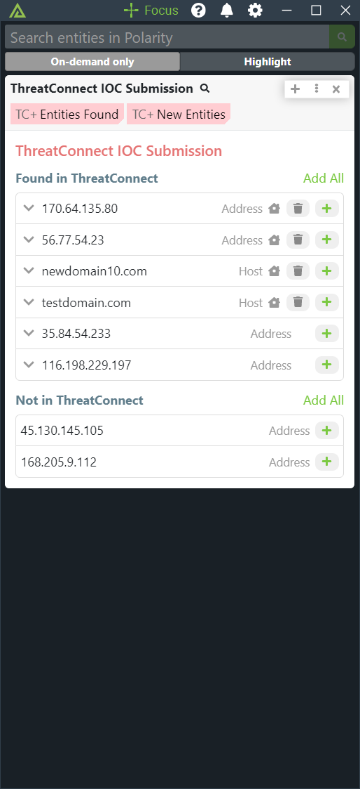
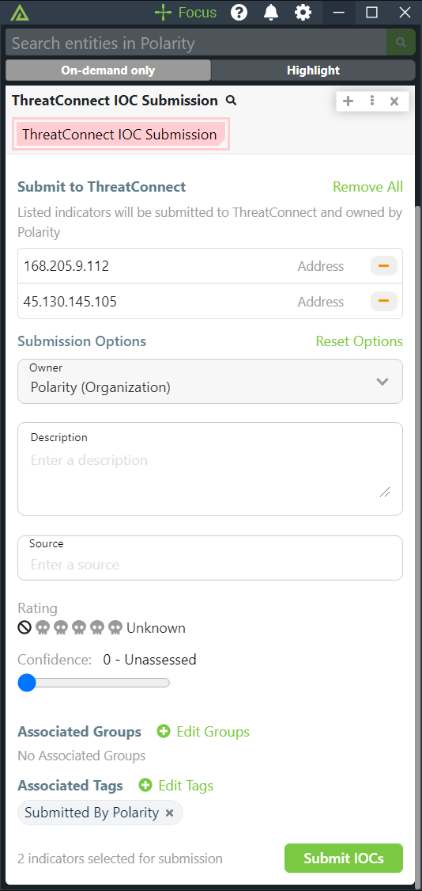
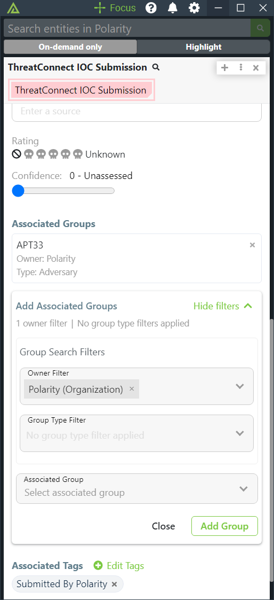

# Polarity ThreatConnect Integration

The Polarity ThreatConnect integration allows Polarity to search your instance of ThreatConnect to return found domains, IPs, hashes, and emails. The integration also allows you to Create and Delete Indicators (IOCs) in bulk from ThreatConnect.

|  |  |  
|--------------------------------|------------------------|------------------------------|
| *Search Results*               | *Submit Indicators*    | *Add Group Associations*     |

## ThreatConnect Integration Options

### ThreatConnect API URL

The API URL of the ThreatConnect instance you would like to connect to (including http:// or https://). If you are running an internal instance of ThreatConnect on a non-default port, please specify the port here as well.

### Access ID

Account Identifier that is associated with the API Key

### API Key

The API (secret) Key associated with the provided Access ID

### Allow IOC Deletion

If checked, users will be able to delete an Indicator from their default Organization in ThreatConnect. (this setting must be set to `User can view only`).

> **_NOTE_**: You can only delete indicators from your own default organization. You cannot delete indicators from other organizations.

### Allow Group Association

If checked, users will be able to Associate Indicators with Groups from ThreatConnect.

## Installation Instructions

Installation instructions for integrations are provided on the [PolarityIO GitHub Page](https://polarityio.github.io/).

## Polarity

Polarity is a memory-augmentation platform that improves and accelerates analyst decision making. For more information about the Polarity platform please see:

https://polarity.io/
