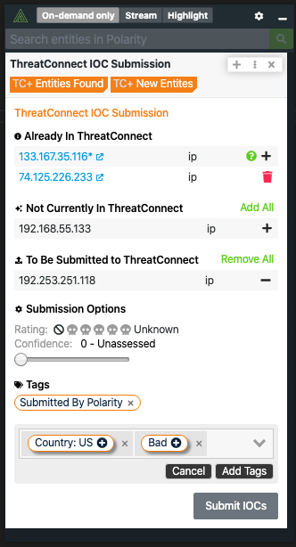

# Polarity ThreatConnect Integration

The Polarity ThreatConnect integration allows Polarity to search your instance of ThreatConnect to return found domains, IPs, hashes, and emails.  The integration also allows you to Create and Delete attributes (IOCs) in bulk from ThreatConnect.

  

## ThreatConnect Integration Options

### ThreatConnect Instance URL

The URL of the ThreatConnect instance you would like to connect to (including http:// or https://).  If you are running an internal instance of ThreatConnect on a non-default port, please specify the port here as well.

### Access ID

Account Identifier that is associated with the API Key

### API Key

The API (secret) Key associated with the provided Access ID

### Allow IOC Deletion

If checked, users will be able to delete an Attribute from ThreatConnect. (this setting must be set to `User can view only`).

> ***NOTE***: When you delete an Attribute you are doing a NOT???? soft delete of the Attribute from the entire system.

## Installation Instructions

Installation instructions for integrations are provided on the [PolarityIO GitHub Page](https://polarityio.github.io/).

## Polarity

Polarity is a memory-augmentation platform that improves and accelerates analyst decision making.  For more information about the Polarity platform please see:

https://polarity.io/
